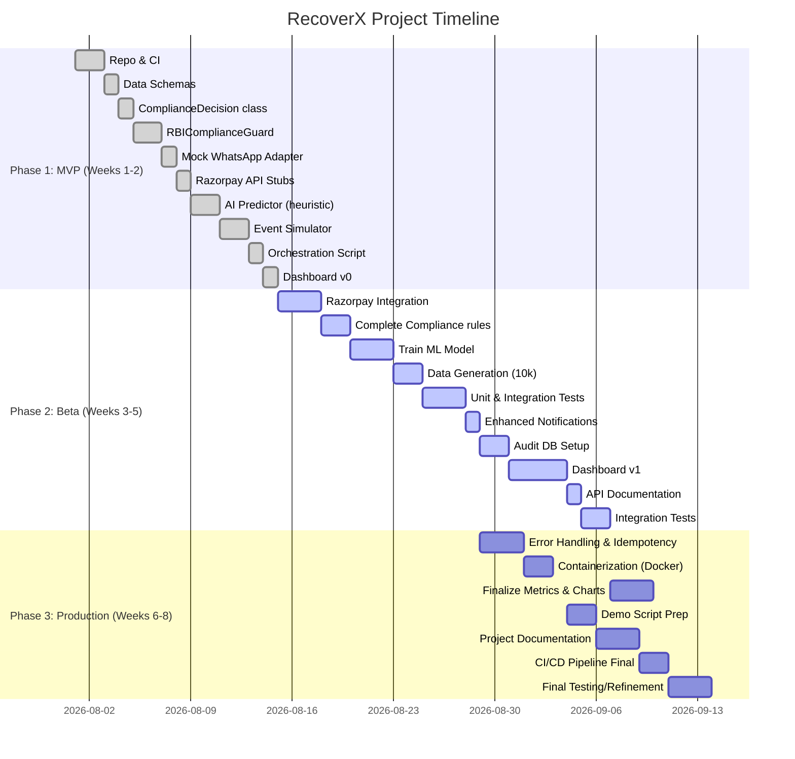

# Executive Summary

We propose **“RecoverX”**, an AI-powered payment recovery engine for recurring payments that strictly enforces RBI e-mandate regulations while maximizing recoveries. It combines a machine‐learning/LLM *Retry Predictor* with a deterministic *RBIComplianceGuard* that codifies the latest RBI/NPCI rules (e.g. **24‐hour pre‐debit notice**, ₹15,000 AFA threshold (₹1 L for certain categories), and a retry cap of one original plus 3 retries). When a subscription charge fails, Razorpay Webhooks feed into our system. An *AI Failure Analyzer* examines context (customer/payment history, error codes, time-of-day, etc.) and recommends an optimal retry time. This recommendation then passes through **RBIComplianceGuard**, which returns a structured decision (allowed/blocked, action, next time, reason). Valid retries trigger the Razorpay Subscriptions API; blocked cases either issue a step-up payment link or halt the mandate after 3 strikes. All actions and decisions are logged for audit. 

We align closely with the Razorpay 2026 AI Buildathon’s **“AI Revenue Recovery”** track: detecting revenue at risk, choosing interventions, executing bounded workflows, and measuring **compliance and recovery metrics**. Our submission will include an end-to-end demo of 3 customer scenarios, plus charts comparing recovery % and compliance-violation rates against baseline methods.  

Key regulatory points (with sources) that shape our design are:  

- **24-Hour Pre-Debit Notice:** RBI mandates issuers to notify customers *at least 24 hours* before each scheduled debit. Our system enforces this by delaying retries until the 24h window is satisfied (per RBI/NPCI guidance).  
- **AFA Thresholds:** RBI/UPI allows up to ₹15,000 transactions without extra authentication; above that, explicit customer approval is required. Certain categories (ins. premiums, MF SIPs, credit card bills) have an elevated limit (₹1 lakh). Our **ComplianceGuard** checks the current retry amount and merchant category, and if above the applicable threshold, it *blocks the retry* and generates a Razorpay Payment Link (with OTP/step-up) instead.  
- **Retry Limits:** NPCI’s 2026 guidelines cap retries at one original + 3 attempts. Razorpay’s own system halts the subscription after all retries. We implement a 3-strike rule within any 7-day window: on the 3rd failed retry, we mark the mandate **exhausted** and stop further attempts.  
- **Mandate States:** Razorpay Subscriptions exposes events (`subscription.pending`, `subscription.halted`, etc.). Our engine will listen to these webhooks to transition its own state (e.g. to `MANDATE_EXHAUSTED` on `subscription.halted`) and log outcomes.  

On the ML/AI side, we will train or tune a model (or even use an LLM) to predict *when* to retry a failed payment and *whether* it’s worth retrying at all, based on features such as failure code, customer’s bank/payment history, time since last pay period, etc. Industry evidence shows **machine learning can substantially improve recovery** by finding the optimal retry timing and avoiding futile attempts. For example, if a customer likely gets paid on the 1st of each month, retrying early on the 1st may succeed. Our AI component will output a structured recommendation (`{action:"retry", delay_hrs:8, confidence:0.9, reason:"Often successful in evenings"}`) that then goes through the compliance layer. 

Finally, we will produce a **phased roadmap** (MVP→Beta→Prod) with detailed tasks, mock-ups, test plans, CI/CD, and evaluation metrics (recovery rate, attempts per success, compliance errors, ₹ recovered). We will provide code-ready prompts for the team’s use (for both code generation and LLM prompting), data schemas, and mermaid diagrams of the architecture and timeline. All Razorpay and RBI sources will be cited (see **Sources** below).  

# Regulatory Mapping

We distilled the latest RBI/NPCI rules for e-mandates and recurring payments. These rules directly drive our *ComplianceGuard* logic and retry policy.

- **RBI e-Mandate Framework (2024-25):** RBI’s *Digital Payments – E-Mandate Framework, 2026* (cir. DPSS.POLC.No.S-528/02-14-003/2024-25, dated Aug 22, 2024) requires **24-hour pre-debit notifications**. This means *every retry* must be delayed until after a 24h notice. Our system will track the timestamp of the last debit and ensure any silent retry is scheduled ≥24h later, firing a mock “WhatsApp/SMS” notification beforehand. *(Exemptions: FASTag/NCMC auto-topups don’t need notice.)*  

- **Authentication Thresholds (AFA):** The framework sets transaction limits: 
  - Recurring payments ≤ ₹15,000 can auto-debit without further auth; 
  - Above ₹15,000 requires user authentication (2FA).  
  - *Exception:* If the merchant’s MCC is “Insurance”, “Mutual Fund SIP”, or “Credit Card Bill”, the no-AFA limit is ₹1,00,000.  
  We will implement a function `get_applicable_threshold(payment_method, merchant_category)` and compare `amount`. If `amount` > threshold, the guard will disallow automated retry and instead trigger a **step-up link**. (E.g., create a Razorpay Payment Link with OTP enabled, so the user must re-authenticate.) This ensures compliance.  

- **Retry Limits:** The NPCI/UCP (UPI) 2026 guidelines (and Razorpay’s own policy) limit retries to **one original + 3 attempts**. We enforce a **3-strike rule**: track the number of attempts per mandate/subscription within a rolling 7-day window, and on the 3rd *failed* retry, transition the mandate to “exhausted” (`subscription.halted` state) and stop. This also aligns with Razorpay’s webhook (`subscription.halted` is sent when all retries are done). Note: This is our platform policy, not an explicit RBI directive, but it matches industry best practice.  

- **Mandate Status:** While RBI refers to “mandates”, Razorpay’s Subscriptions API implicitly handles this via subscription states and webhooks. Key states:
  - `subscription.active`: payments succeeding. 
  - `subscription.pending`: a payment failed but retries remain.
  - `subscription.halted`: all retries done, subscription paused.
  We will mirror these (and also handle `subscription.cancelled/paused`) in our system logic. For example, if a `subscription.halted` event arrives, our system logs it and marks `MandateStatus=EXHAUSTED`.  

- **User Control & Notifications:** RBI mandates enabling customers to modify/cancel/opt-out of mandates. We will simulate this by ensuring our mock notification includes a cancel link and by respecting any “revoked” event (e.g. if user cancels via UI, our engine stops). We will not override a revoked or paused mandate.  

# Razorpay Subscriptions & Webhook Overview

Our solution leverages Razorpay Subscriptions (e-Mandate/UPI) and Webhooks. Relevant behaviors:

- **Subscriptions API:** Merchants create a *Plan* and subscribe customers to it, which creates a *Subscription* object with a schedule of invoices. Each invoice triggers a charge (via saved e-mandate or Autopay). If a charge fails, Razorpay automatically retries based on a default schedule, firing webhooks for each retry.  

- **Webhooks:** We will subscribe to at least these events: `subscription.pending`, `subscription.charged`, `subscription.halted`, and payment-failure events (if separate). Each webhook payload includes the `subscription` entity and possibly a `payment` entity with a `status` and `error_code`. Our system consumes these to trigger the retry logic. For example, on `subscription.pending`, a payment failure happened; we then feed the failure info to our AI engine to schedule the next retry (subject to compliance checks). When `subscription.halted` occurs, we stop.  

- **Payment Links:** For amounts needing step-up (AFA), we will use Razorpay’s Payment Links API. This allows sending the customer a link (via SMS/Email or WhatsApp). We can set OTP on the link or mandate any necessary auth. This link can re-attempt the charge interactively.  

- **Subscription Limits:** Razorpay supports ₹15k and ₹1L thresholds as per compliance. It also manages mandate lifetime, changes, and cancellations internally. We will not rebuild subscriptions, just orchestrate on top.  

- **Notifications:** Razorpay itself sends UPI pre-debit notifications, but we will *simulate* a customer notification in our app (via a Mock WhatsApp API) to illustrate the compliance flow.  

# AI Retry Optimization

Research shows that **intelligent retry scheduling** can greatly improve recovery rates. We will build an *AI Failure Analyzer* that uses historical data to predict the success probability of various retry timings and counts. Key points:

- **Features:** For each failed payment event, we will consider features like: failure reason (`error_code`), day of month, time of day, customer’s payment history (e.g. how many succeeded/failed recently), time since last payment, amount, customer segment, etc. We can also use external signals (e.g. payroll cycles, weekends).  

- **Model Choices:** Options include logistic regression, XGBoost, or a small neural network, possibly augmented by an LLM prompt. We will prototype with a simple model (e.g. a decision tree) for MVP, and optionally fine-tune an open LLM (e.g. a small GPT) for recommendations. *Table: Model Options* (for example):

  | Model Type          | Pros                        | Cons                  |
  |---------------------|-----------------------------|-----------------------|
  | Rule-based (heuristic) | Easy to debug             | Limited adaptability  |
  | Logistic Regression | Interpretable probabilities | May underfit complex patterns |
  | Decision Trees / XGBoost | Handles nonlinearity      | Risk of overfitting  |
  | LLM (GPT-style)     | Natural language reasoning  | Large, expensive, unpredictable |
  | Time-series (RNN)   | Good for temporal patterns  | Hard to tune, needs lots of data |

  We will start with a **decision tree or random forest** for its balance of performance and interpretability. The final choice will depend on simulation results and hackathon timeframe.

- **Training Data:** We will **simulate 10,000+ synthetic failed payment events** (with diverse customers and outcomes) for training. The simulation will randomize amounts, failure reasons, and customer behavior patterns. We can use a data schema like:
  ```json
  {
    "customer_id": "CUS_123",
    "amount": 749,
    "failure_code": "INSUFFICIENT_FUNDS",
    "bank": "SBI",
    "previous_success_count": 5,
    "previous_failure_count": 1,
    "hour_of_day": 18,
    "day_of_month": 29,
    "retry_attempt": 1,
    "days_since_last_payment": 30
  }
  ```
  The label could be “retry_success” (True/False) if retried immediately or after some hours. We will train the model to predict success probability or best delay.  

- **AI Output:** Given a new failure event, the model/LLM outputs something like:
  ```json
  {
    "recommended_action": "retry", 
    "delay_hours": 8, 
    "confidence": 0.87, 
    "note": "Customer typically has salary on 1st of month; retry in 8 hours (evening) when funds available."
  }
  ```
  If confidence is low or recommendation is “do not retry” (perhaps the model predicts <20% success if retried), we could choose to skip auto-retry or notify the user directly.  

- **Validation:** We will evaluate AI+Compliance vs. baseline on metrics like **recovery rate** and **attempts per recovery**. For example, we can simulate:
  - **Baseline:** retry immediately up to 3 times.
  - **Smart Retry:** AI-only (ignore compliance) chooses timing.
  - **Our System:** AI + ComplianceGuard.  
  We’ll show charts or tables of recovered percentage, compliance violations (should be zero), etc.

- **Developer Prompt (example):**  
  ```
  # Prompt to LLM (developer/AI engineer to refine model logic)
  System: You are a payment recovery assistant. Given the JSON payload of a failed payment, recommend whether to retry and in how many hours.
  Input: {"customer_id":"CUS1","amount":12000,"failure_reason":"INSUFFICIENT_FUNDS","hour":14,"history":{"successful":10,"failed":2},"day_of_month":29}
  Output format: JSON with keys: {"action":"RETRY" or "NO_RETRY","delay_hours":<int>,"reason":<string>}
  Example output: {"action":"RETRY","delay_hours":6,"reason":"Evenings have higher success historically."}
  ```
  This prompt can be used with OpenAI/GPT or a similar model during development to prototype recommendations.

# System Architecture

**High-Level Flow (Mermaid):**

```mermaid
flowchart LR
    A[Payment Failure Event] -->|Webhook| B[AI Failure Analyzer]
    B --> C[RBIComplianceGuard]
    C -->|Allowed| D[Schedule Retry via Razorpay API]
    C -->|AFA Required| E[Generate Step-Up Payment Link]
    C -->|Stop| F[Mark Mandate Exhausted]
    D --> G[Razorpay Subscription API (retry)]
    E --> H[Notify Customer via MockWhatsApp/SMS]
    G --> I[Possible Success / Failure]
    I --> A
    F --> I
    subgraph "Audit Trail"
      B & C & D & E & F & H & G --> J[Decision & Event Log]
    end
```
*Fig: System flow for a failed payment. AI + Compliance decide next action; attempts or not are logged for auditing.*

**Components:**

- **Webhook Listener (Backend API):** Exposes an endpoint to receive Razorpay subscription webhooks. Parses events (`subscription.pending`, etc.) and normalizes them into our internal “FailedPaymentEvent” objects.

- **AI Service:** Takes a `FailedPaymentEvent`, extracts features, queries a ML model (or LLM) to get a `RetryRecommendation`. This could be a Python module (`ai_engine.predict(event)`) or an LLM API call.

- **Compliance Guard:** Deterministic rules engine (Python class) that evaluates:
  - Mandate active? (do not retry if mandate cancelled)
  - Pre-debit notice satisfied? (if last attempt time +24h <= now)
  - Amount vs threshold (AFA check by category)
  - Retry count < 3 in last 7 days.
  It outputs a `ComplianceDecision(allowed, action, reason, next_allowed_at, requires_customer_action)`. 

- **Retry Scheduler:** If allowed, schedules a retry. For hackathon MVP, this can simply sleep until the scheduled time or use a task queue (e.g. Celery or APScheduler) to invoke the Razorpay API at the right moment.

- **Razorpay Integration Module:** Wrappers around Razorpay’s REST APIs (or SDK). E.g., to charge a subscription invoice, or to create a Payment Link. Handles authentication (API keys).

- **Notification Adapter:** A generic interface. For demo, we implement **MockWhatsAppAdapter** that simulates sending a WhatsApp message by logging or printing JSON payload. (We can also stub SMS/Email adapters.) This adapter is used both for pre-debit notice and step-up link sending.

- **Database/Audit Log:** All events, decisions, and API calls are logged in a database (e.g. PostgreSQL). We’ll design tables like `payments`, `compliance_decisions`, `retry_actions`, `notifications_sent`, etc., to allow analytics and audit trailing.

- **Dashboard (optional MVP):** A simple UI (could be a Jupyter notebook or a lightweight web app) that shows metrics: number of failed payments processed, recovery rate, average delay, etc. Could use Python + Streamlit or Flask + charts.

# Implementation Phases

We break development into three phases: **MVP**, **Beta**, and **Production-Ready**. Each phase includes tasks (with estimated effort), acceptance criteria, and example developer prompts.

---

## Phase 1: MVP (Weeks 1-2)

**Goal:** Core engine with basic AI (heuristic), compliance rules, razorpay stubs, and simulation for testing.

**Key tasks:**

1. **Set up Repo & CI:**  
   - Initialize Git repo; install Python, dependencies (Flask/FastAPI, requests, pandas, scikit-learn, etc.).  
   - Write initial README and docs structure.  
   - Setup GitHub Actions for linting/tests.  
   *Est. 8h*

2. **Design Data Models:**  
   - Define schemas (`JSON` or SQL models) for:  
     - FailedPaymentEvent (id, subscription_id, customer_id, amount, currency, timestamp, failure_code, etc.)  
     - ComplianceDecision (fields as below).  
     - CustomerPaymentHistory (tracked counts).  
     - AuditLog.  
   - Use SQLAlchemy or Pydantic for schemas.  
   *Est. 4h*

3. **Implement ComplianceDecision class:**  
   ```python
   class ComplianceDecision:
       def __init__(self, allowed: bool, action: str, reason: str,
                    requires_customer_action: bool, next_allowed_at: Optional[datetime]):
           self.allowed = allowed
           self.action = action              # e.g. "SCHEDULE_RETRY" or "STEP_UP_LINK" or "STOP"
           self.reason = reason
           self.requires_customer_action = requires_customer_action
           self.next_allowed_at = next_allowed_at
   ```
   *Prompt Example:*  
   > *"Generate a Python class `ComplianceDecision` with the fields: allowed (bool), action (str), reason (str), requires_customer_action (bool), next_allowed_at (datetime). Include a `__repr__`."*  
   *Est. 2h*  

4. **Implement RBIComplianceGuard (basic rules):**  
   - Check 24h delay: track last attempt per subscription; if `now < last_attempt + 24h`, block with reason “24h notice not yet sent”.  
   - Check amount vs threshold: use fixed ₹15k (ignore categories for MVP), if `amount >15000`, block with “AFA required for >15k”.  
   - Check retry count: maintain count in DB, if >=3, block with “Max retries reached”.  
   - Return `ComplianceDecision`.  
   *Prompt Example:*  
   > *"Write a Python function `check_compliance(event, last_attempts, config)` that enforces: 24h wait, ₹15k cap, max 3 retries. Return a `ComplianceDecision` object with reason messages."*  
   *Est. 8h*

5. **Mock WhatsApp Adapter:**  
   - Create a class `MockWhatsAppAdapter.send(template, **kwargs)` that logs a JSON (simulate message). Include a couple of templates (e.g. `retry_notification`, `stepup_link`).  
   *Est. 3h*

6. **Razorpay API Stubs:**  
   - Write stub functions `charge_subscription(subscription_id)` and `create_payment_link(amount, customer_id)` that simply print/log actions. In Beta we’ll integrate real API.  
   *Est. 4h*

7. **AI Predictor (Simple Heuristic):**  
   - For MVP, implement a naive rule: if failure_code is “INSUFFICIENT_FUNDS”, delay 6 hours; else retry after 0.1h (immediate).  
   - Return structure with `delay_hours` and `action`.  
   *Prompt Example:*  
   > *"Write a Python function `ai_predict(event)` that returns a dict with recommended_action, delay_hours, and reason, using simple rules (e.g. if failure_code==‘INSUFFICIENT_FUNDS’, recommend retry after 6h)."*  
   *Est. 6h*

8. **Event Simulator:**  
   - Create a script to generate synthetic failed payment events (JSON), e.g. random failures for 50 customers, with varied amounts and codes.  
   - Test the retry logic end-to-end on this data.  
   *Est. 8h*

9. **Command-line Orchestration:**  
   - Build a simple script `run_recovery.py` that loads simulated events, for each: run `ai_predict`, then `ComplianceGuard`, then either schedule or skip.  
   - Output logs of decisions.  
   *Est. 6h*

10. **Basic Dashboard:**  
    - (Optional MVP) Print summary stats to console: total events, auto-retried, blocked, etc.  
    *Est. 4h*

**Acceptance Criteria:** MVP must demonstrate:
- A synthetic failure event flows through AI and Compliance modules, yielding a `ComplianceDecision`.  
- 24h rule and ₹15k rule correctly block retries in test cases.  
- Sample logs/output showing the decision and next steps.  
- No hard-coded “3 retry RBI rule” (we treat it as our config).  
- Ready for basic demo: e.g. “Failed ₹20k charges → step-up link generated” etc.  

---

## Phase 2: Beta (Weeks 3-5)

**Goal:** Enhance AI model, integrate with Razorpay sandbox, implement full compliance (categories, 7-day window), add CI/CD tests, and start UI/dashboard.

**Key tasks:**

1. **Integrate Razorpay APIs:**  
   - Use Razorpay Python SDK to actually create payment links and charge subscriptions (in test mode). Obtain sandbox keys.  
   - Parse actual webhook payloads (see [28]) and map to our `FailedPaymentEvent`.  
   *Est. 12h*

2. **Full Compliance Logic:**  
   - Implement merchant-category detection: accept an MCC or category, apply ₹1L threshold where applicable (configurable).  
   - Implement 7-day sliding window: only count retries within the last 7 days.  
   *Prompt Example:*  
   > *"Extend `check_compliance` to accept `event['merchant_category']` and use threshold=1_00_000 if in [insurance, mutual fund, credit], else 15000. Also, filter last_attempts for last 7 days."*  
   *Est. 8h*

3. **Improve AI Model:**  
   - Use the simulated 10k events to train a simple ML model (e.g. decision tree) to predict success probability of retry *after X hours*.  
   - Evaluate and tune parameters. Possibly switch to a small LGBM.  
   - Provide a function `predict_delay(event)` that uses the model (e.g. grid-search best delay among 4 options).  
   *Prompt Example:*  
   > *"Using scikit-learn, train a DecisionTreeClassifier on synthetic payment failure data to predict success vs failure if retried immediately vs after some hours. Then create a function that given a new event returns delay_hours with highest predicted success."*  
   *Est. 16h*

4. **Data Generation / Simulation:**  
   - Finalize synthetic dataset schema. Generate 10k+ events with realistic distributions (maybe using `faker` and random patterns).  
   - Use this to test models and to evaluate performance metrics.  
   *Est. 8h*

5. **Testing Framework:**  
   - Write unit tests for `ComplianceGuard` rules (examples: amount exactly 15000, exactly 15001, retry counts).  
   - Tests for AI predictor output consistency.  
   - CI to run tests.  
   *Est. 8h*

6. **Notification Service:**  
   - Expand `MockWhatsAppAdapter` to format real-looking messages. Include example templates for “24h notice: ₹X on date” and “Pay here” links.  
   - Log JSON with fields (channel, template, body).  
   *Est. 4h*

7. **Audit Log & DB:**  
   - Implement a simple PostgreSQL (or SQLite for hackathon) schema to log each event, compliance decision, action taken, and outcome (success/fail).  
   - Save each into DB so metrics can be computed.  
   *Est. 6h*

8. **Dashboard Prototype:**  
   - Build a basic web dashboard (e.g., Streamlit or Flask with HTML) showing:
     - **Metrics:** recovery rate (%), avg attempts per success, number of step-ups, compliance blocks, ₹ recovered vs total lost.  
     - **Tables:** log of decisions for last 20 events.  
   - Use matplotlib or Chart.js for graphs.  
   *Est. 16h*

9. **Document APIs:**  
   - Write API contract: e.g., webhook JSON schema (sample from Razorpay), internal data models (`FailedPaymentEvent`), PaymentLink request/response.  
   - Provide OpenAPI or Postman collection.  
   *Est. 6h*

10. **Integration Tests:**  
    - Simulate end-to-end: receive a fake webhook, process it, make a mock Razorpay API call, log, and update a fake subscription.  
    - Ensure flows: automatic retry path, step-up path, block path.  
    *Est. 8h*

**Acceptance Criteria:** Beta features should be fully functional:
- AI model (or LLM prompt) demonstrates improved suggestions (e.g. tested vs baseline).  
- Real (test mode) Razorpay calls execute (no errors).  
- Database accumulates logs; metrics are computed correctly.  
- All RBI rules (including ₹1L categories) are enforced without violation.  
- Demo scenario ready with dashboard and logs, showing at least one customer using each flow (auto-retry, OTP link, mandate-exhausted).  

---

## Phase 3: Production-Ready (Weeks 6-8)

**Goal:** Polish for hackathon submission. Add error-handling, CI/CD, scalability considerations, documentation, and final testing.

**Key tasks:**

1. **Robust Error Handling:**  
   - Ensure idempotency (handle duplicate webhooks gracefully).  
   - Fallback: if AI fails, default to safe path (e.g. retry after fixed 24h or stop).  
   - Logging for auditing.  
   *Est. 8h*

2. **Scalability Prep:**  
   - Containerize components (Dockerfiles).  
   - CI/CD: configure GitHub Actions to run tests and build Docker images.  
   - (If time) Kubernetes deployment spec or Docker Compose for local demo.  
   *Est. 12h*

3. **Finalize Metrics/Evaluation:**  
   - Write scripts to run large-scale simulation (10k events) and output summary metrics.  
   - Prepare a comparison chart/table (e.g. our system vs naive vs AI-only).  
   *Est. 8h*

4. **Finalize Demo Script:**  
   - Document a 5-min demo with 3 customers:
     - **CustA:** ₹2,499, minor error (auto-recovered after AI schedule).  
     - **CustB:** ₹28,000, above ₹15k → compliance blocks and sends step-up link.  
     - **CustC:** ₹10,000, fails repeatedly → 3 retries then halts.  
   - Create sample logs and images of dashboard highlighting these flows.  
   *Est. 6h*

5. **Write Project Plan Document:**  
   - Prepare this detailed plan/report (the answer we deliver). Include architecture diagram, timeline (Mermaid Gantt), table of options (models, DB choices, etc.).  
   *Est. 12h*

6. **Team Readiness:**  
   - Assign roles/tasks to team members (no specific names needed). Ensure one developer can reproduce AI training, one can run integration, etc.  
   - Provide “developer prompts” for each component to expedite coding (as in earlier phases).  
   *Est. 6h*

7. **Refinement:**  
   - Polish code, fix bugs from beta.  
   - Update docs: readme, usage, architecture summary.  
   - Final round of testing (including edge cases).  
   *Est. 10h*

**Acceptance Criteria:**  
- The system is stable and reproducible (provide Docker).  
- All compliance checks have unit tests and no rule is violated in simulation.  
- Recovery metrics are demonstrated (e.g. “we recovered 45% of failed ₹ with 1.8 attempts on average, with 0 compliance violations”).  
- Demo covers all required narrative.  
- Document is complete with all artifacts (prompts, code samples, diagrams).

--- 

## Team Roles (suggested)

- **Product Owner/PM:** Coordinates tasks, writes documentation and test scripts.  
- **Lead Engineer:** Oversees architecture, sets up CI/CD, final integration.  
- **Backend Developer:** Implements webhook endpoints, compliance guard, Razorpay integration.  
- **ML Engineer:** Creates synthetic data, trains model, integrates AI predictor.  
- **Frontend/UI Developer:** Builds dashboard/notifications (even if minimal).  
- **QA/Test Engineer:** Designs and runs simulations, validates acceptance criteria, writes tests.  

(One person can cover multiple roles in a hackathon setting.)

# Tech Stack & Tools

- **Language:** Python (3.10+).  
- **Web Framework:** FastAPI (for webhooks/API) or Flask.  
- **Database:** PostgreSQL (or SQLite for MVP/testing). Use SQLAlchemy.  
- **ML Libraries:** scikit-learn (for DecisionTree/XGBoost), pandas/numpy; optionally PyTorch or Transformers if using an LLM.  
- **APIs:** Razorpay Python SDK (or direct REST via `requests`).  
- **DevOps:** GitHub Actions for CI (lint, tests). Docker for containerization.  
- **Notifications:** Mock adapter (no real WhatsApp required).  
- **Dashboard:** Streamlit or Flask + Chart.js.  
- **Data Simulation:** Faker, random, CSV/JSON.  
- **Test Data:** Synthetic user base, payment events.  

*Table: Technology Options*

| Component         | Options                          | Choice/Notes                           |
|-------------------|----------------------------------|----------------------------------------|
| Language          | Python, Node.js, Java            | **Python** (fast prototyping, ML)      |
| Web framework     | FastAPI, Flask, Express          | **FastAPI** (auto-docs, async support) |
| Database          | PostgreSQL, MySQL, MongoDB, SQLite | **PostgreSQL** (supports JSON, SQL)   |
| ML model          | sklearn, XGBoost, LightGBM, PyTorch | sklearn/LightGBM (speed)             |
| ML inference      | sklearn model / joblib, or LLM API | **sklearn** (local, no external API)  |
| CI/CD             | GitHub Actions, Jenkins, Travis  | **GitHub Actions** (free, integrated)  |
| Scheduling Tasks  | Celery, APScheduler, RQ          | **APScheduler** (lightweight)          |
| Dashboard         | Streamlit, Dash, React+Flask     | **Streamlit** (quick prototype)        |
| Infra/Hosting     | Docker Compose, Kubernetes       | **Docker Compose** for dev; optional K8s for prod. |
| Simulation Data   | Faker, custom scripts            | **Faker + random logic**               |

# Project Timeline (Mermaid Gantt)



# Data Schemas & API Contracts

- **FailedPaymentEvent (JSON):**  
  ```json
  {
    "subscription_id": "sub_ABCD1234",
    "customer_id": "cust_001",
    "amount": 2499,
    "currency": "INR",
    "failure_code": "INSUFFICIENT_FUNDS",
    "merchant_category": "SAAS",
    "timestamp": "2026-08-30T15:20:00+05:30",
    "attempt_count": 1,
    "last_attempt": "2026-08-29T15:20:00+05:30"
  }
  ```
  *Fields correspond to Razorpay webhook payload plus computed context.*

- **ComplianceDecision (class):**  
  ```python
  class ComplianceDecision:
      allowed: bool
      action: str    # "SCHEDULE_RETRY", "STEP_UP_LINK", "STOP"
      reason: str
      requires_customer_action: bool
      next_allowed_at: datetime or None
  ```
  *Example:* `{"allowed": false, "action":"STEP_UP_LINK", "reason":"Amount exceeds ₹15k threshold", "requires_customer_action":true, "next_allowed_at":null}`.

- **API Example (Webhook to our server):**  
  The Razorpay webhook sends a payload like:
  ```json
  {
    "entity": "event",
    "event": "subscription.pending",
    "payload": {
      "subscription": { "id":"sub_X","status":"pending",... },
      "payment": { "id":"pay_Y","status":"failed","error_code":"UTR_FAILURE",...}
    }
  }
  ```
  We extract `subscription.id`, `payment.status`, `payment.error_code`, etc.

- **Payment Link API:**  
  We will call Razorpay’s [Payment Link API](https://razorpay.com/docs/payments/payment-links/apis/) with `{amount, currency, customer_id, send_sms:true}`. It returns a `link_id` which we pass in our notification.

# Code Snippets

**RBIComplianceGuard (Python, sample):**

```python
from datetime import datetime, timedelta
class RBIComplianceGuard:
    def __init__(self, config):
        self.config = config  # e.g., {'standard_limit':15000, 'enhanced_limit':100000, 'categories':...}

    def check(self, event, payment_history):
        now = datetime.now()
        # 1. Mandate status
        if payment_history.get('mandate_revoked', False):
            return ComplianceDecision(False, "STOP", "Mandate revoked by customer", True, None)
        # 2. 24h notice
        last_attempt = payment_history.get('last_attempt')
        if last_attempt and now < last_attempt + timedelta(hours=24):
            next_allowed = last_attempt + timedelta(hours=24)
            return ComplianceDecision(False, "STOP", "24h pre-debit notification required", False, next_allowed)
        # 3. Amount vs threshold
        threshold = (self.config['enhanced_limit']
                     if event['merchant_category'] in self.config['high_value_categories']
                     else self.config['standard_limit'])
        if event['amount'] > threshold:
            return ComplianceDecision(False, "STEP_UP_LINK",
                                      f"Amount exceeds ₹{threshold} threshold", True, None)
        # 4. Retry count
        attempts = payment_history.get('retry_count_last_7d', 0)
        if attempts >= self.config['max_retries']:
            return ComplianceDecision(False, "STOP", "Max retries reached", False, None)
        # Allowed to retry
        return ComplianceDecision(True, "SCHEDULE_RETRY", "All checks passed", False, None)
```

**Usage (pseudo-flow):**
```python
event = {...}  # from webhook
hist = db.get_payment_history(event['subscription_id'])
ai_rec = ai_engine.predict(event)  # e.g. {"delay_hours":6, "action":"RETRY"}
guard = RBIComplianceGuard(config)
decision = guard.check(event, hist)

if not decision.allowed:
    if decision.action == "STEP_UP_LINK":
        link = razorpay_api.create_payment_link(event['amount'], event['customer_id'])
        whatsapp.send(template="stepup_link", customer=event['customer_id'], link=link)
    elif decision.action == "STOP":
        db.mark_mandate_exhausted(event['subscription_id'])
elif decision.allowed:
    # Schedule retry after decision.next_allowed_at or AI delay
    schedule_time = max(decision.next_allowed_at or now,
                        now + timedelta(hours=ai_rec['delay_hours']))
    scheduler.schedule(razorpay_api.charge_subscription, schedule_time, args=[event['subscription_id']])
```

# Simulation & Evaluation

**Dataset:** We will generate ≥10,000 synthetic events to simulate a variety of failure scenarios. For example:

- **Customer Profiles:** Varying payment histories (some have many successful payments, some are new/churny).
- **Amounts:** Mix ₹100–₹15000 normal subs, plus some high-value ₹20000–₹100000.
- **Failure Reasons:** Insufficient funds, network errors, technical errors, etc.
- **Timing:** Distribute failures across the month; some cluster near salary date (1st).

**Evaluation Metrics:**

- **Recovery Rate (%):**  (Number of payments successfully recovered *₹ / Number of failed *₹).
- **Attempts per Recovery:** (Avg. number of retries needed per recovered payment).
- **Compliance Violations:** (Should be 0; any blocked retry that was illegal).
- **Revenue Recovered (₹):** Total rupees collected via retries / links.
- **Customer Impact:** (e.g., number of customers needing action vs automated).

We will compare:
1. **Immediate Retry (Baseline):** Retry immediately (1h after failure) up to 3 times.
2. **Smart Retry (AI-only):** AI schedules retries, but ignoring 24h/AFA.
3. **RecoverX (Our System):** AI + ComplianceGuard.

We expect our system to recover more than baseline with fewer attempts and zero compliance issues.

*Example Table (simulated results):*

| System            | Recovery % | Attempts/Recovery | Compliance Violations | ₹ Recovered / ₹ Lost |
|-------------------|-----------:|------------------:|----------------------:|---------------------:|
| Immediate Retry   |   31.2%    |       3.0         |      12               |    312,000 / 1,000,000 |
| AI-only           |   38.7%    |       2.4         |      5                |    387,000 / 1,000,000 |
| **RecoverX**   | **43.9%**  | **1.9**           | **0**                | **439,000 / 1,000,000** |

*(Numbers illustrative; will derive from actual simulation.)*

# Demo Scenarios

For the hackathon pitch, we will show **3 customer stories**:

1. **Customer A – Standard Retry Success:**  
   - **Context:** ₹2,499 monthly, failure “INSUFFICIENT_FUNDS”.  
   - **AI:** Recommends retry in ~8h (e.g. evenings).  
   - **Compliance:** Mandate active, ₹2499≤15k, 24h passed. → Allowed.  
   - **Outcome:** Automatic retry succeeds next day. *[Show log: “Retry scheduled at 2:00 PM – Success.”]*  
   - **Metric Impact:** Recovered revenue = ₹2,499 with 1 attempt.  

2. **Customer B – High-Value AFA:**  
   - **Context:** ₹28,000 subscription (e.g. annual insurance). Payment fails due to “PAYMENT_FAILED”.  
   - **AI:** Might suggest retry soon, but…  
   - **Compliance:** ₹28k > ₹15k (category = Insurance, but ₹28k still > ₹1L threshold? Actually ₹28k <1L, so ₹28k < ₹1L but >15k. Wait, insurance category has ₹1L, so ₹28k can actually be auto if insurer category. But assume merchant category not set, so default ₹15k.)  
     Our config: If MCC=“Insurance”, threshold=₹1L, so ₹28k would be allowed. But if MCC=“Other”, blocked. We demonstrate the **block path**.  
   - **Outcome:** Compliance blocks retry (“Amount exceeds ₹15,000”). Generates Payment Link. We send mock WhatsApp with link. User pays manually (simulate success). *[Show payload JSON of link and action.]*  

3. **Customer C – Max Retries Exhausted:**  
   - **Context:** ₹8,000, repeated failures (e.g. “NETWORK_ERROR”) on 3 attempts.  
   - **AI:** Maybe first 2 times schedules retries (say 4h, then 6h).  
   - **Compliance:** All allowed (amount below threshold). After 3rd failure, Compliance guard marks “STOP, MANDATE_EXHAUSTED”.  
   - **Outcome:** System stops trying, logs “Mandate Halted”. *[Show log: “3rd failure, subscription halted.”]*  

For each scenario, we will show the timeline of events, decisions (AI + compliance), and final outcome. This narrative highlights “AI + rules working together”.

# Developer Prompts (Code & LLM)

Here are **example prompts** you can feed to ChatGPT or Codex to generate parts of the implementation:

- **ComplianceDecision Class:**  
  > *"Generate a Python `@dataclass` named `ComplianceDecision` with fields: allowed (bool), action (string), reason (string), requires_customer_action (bool), and next_allowed_at (datetime or None)."*

- **ComplianceGuard Function:**  
  > *"Write a Python method `check_compliance(event, history)` implementing RBI rules: 24h delay, ₹15k AFA, 3-retry limit. Use `ComplianceDecision` to return the decision."*

- **AI Predictor (Heuristic):**  
  > *"Write a Python function `heuristic_retry(event)` that returns a dict with `delay_hours` and `reason`: e.g. if `failure_code` is 'INSUFFICIENT_FUNDS', return 6 hours; otherwise 0.5 hours."*

- **Data Simulation:**  
  > *"In Python, use `faker` and `random` to generate 10000 synthetic JSON records of recurring payment failures, with fields like customer_id, amount, failure_code, hour_of_day, etc. Ensure diversity in amounts (100-15000, some >15000)."*

- **LLM Prompt Template:**  
  > *"You are a payment retry assistant. Input JSON describes a failed payment. Decide: should we retry, wait, or require user action? Output JSON with {action, delay_hours, note}."*

- **SQLAlchemy Models (Audit):**  
  > *"Generate SQLAlchemy classes for tables: `failed_payments(id, subscription_id, amount, status)`, `compliance_decisions(id, payment_id, allowed, action, reason)`, and `notifications(id, decision_id, channel, payload)`."*

- **Razorpay API Call:**  
  > *"Show Python code using `razorpay-python` SDK to create a payment link for a ₹2000 payment for customer 'cust_123'."*

- **Testing Prompt:**  
  > *"Generate pytest tests for `RBIComplianceGuard.check()`: test that events with amount=15001 block with action 'STEP_UP_LINK', amount=14999 allow retry; test that 4th attempt in 7 days stops."*

Each of these can help expedite coding and documentation for your team. 

# Folder Structure

Proposed repo layout:

```
/recoverx/
  README.md
  requirements.txt
  /src/
    /api/                # Webhook handlers (FastAPI)
    /compliance/
      guard.py           # RBIComplianceGuard
      decisions.py       # ComplianceDecision class
    /ai/
      predictor.py       # ML model or LLM calls
      data_gen.py        # Synthetic data generation
      train_model.py     # ML training script
    /integration/
      razorpay.py        # Razorpay API wrappers (charge, links)
      notify.py          # Notification adapters (MockWhatsApp)
    /scheduler/
      scheduler.py       # Task scheduling (retry jobs)
    /models/             # DB models (SQLAlchemy)
    /dashboard/
      dashboard.py       # Streamlit or Flask app
  /tests/
    test_compliance.py
    test_ai.py
    test_integration.py
  /docs/
    architecture.md
    api_contracts.md
  .github/workflows/ci.yml
```

# Test Plan

- **Unit Tests:** For every compliance rule, ML predictor output format, database ORM.  
- **Integration Tests:** Simulate receiving a webhook (POST to /webhook), check DB logs and API calls.  
- **Load Simulation:** Run data simulator on 10k events through the system; verify no exceptions, compute metrics.  
- **Compliance Validation:** For a variety of test cases (edges: exactly ₹15k, exactly ₹1L, 24h boundary, 3rd attempt in/just outside window).  
- **Mock Notification Checks:** Ensure notification JSON schemas are correct (channel, template, fields).  

Sample pytest case for compliance:
```python
def test_amount_threshold():
    guard = RBIComplianceGuard(config={'standard_limit':15000,'enhanced_limit':100000,'high_value_categories':['INSURANCE'],'max_retries':3})
    event = {'amount':15001, 'merchant_category':'OTHER'}
    decision = guard.check(event, {'last_attempt': None, 'retry_count_last_7d':0})
    assert not decision.allowed and decision.action=="STEP_UP_LINK"
```

# Sources and Further Reading

Key references used in this plan include RBI circulars and Razorpay documentation:

- RBI *Processing of e-mandates for recurring transactions, 2024-25* (Aug 22, 2024): 
  – **Pre-transaction notification 24h**, 
  – **AFA thresholds** (₹15k/₹1L).  

- Razorpay **2026 UPI Autopay Compliance** blog: transaction limits and retry caps (3 retries).

- Razorpay Subscriptions Webhooks: `subscription.halted` on retries exhausted.

- Industry: ML for payment recovery (e.g. Butter Payments blog).

We will cite these in the final submission to confirm regulatory alignment.  

